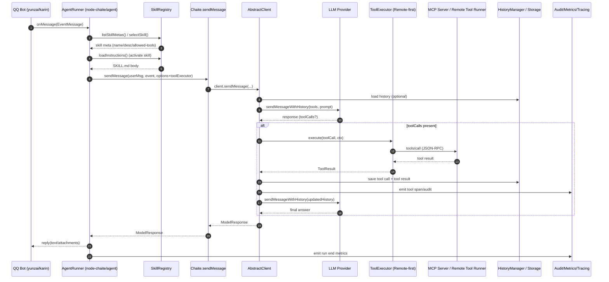

# Harness engineer 与远程优先 Agent “库化”路线：node-chaite 深度研究与可编码方案

## 执行摘要

已启用连接器：github（通过 GitHub 连接器对 ikechan8370/node-chaite 做了代码、README、变更记录与 PR 审查）。

本次研究结论可以概括为三句话：

node-chaite **已经具备“可控工具调用循环”的雏形**：其 `AbstractClient.sendMessage()` 在模型返回 `toolCalls` 时，会在同一进程内解析工具、执行 `tool.run()`、把工具结果写入历史，再递归继续对话，直到模型返回非工具调用响应。fileciteturn63file0L1-L1 这意味着它不是“纯 SDK”，而是一个已经带有最小 agent loop 的“可嵌入式运行内核”。

node-chaite 的当前定位非常贴近你最新的“依赖库+抽象+远程优先”方向：项目自述定位为 chatgpt-plugin 与 karin 生态插件的核心库；提供多模型适配（OpenAI / Gemini / Claude）、工具系统、处理器/触发器、RAG、预设与频道管理、以及（可选）Express API/前端，并已经把存储抽象成 `BasicStorage`。fileciteturn62file0L1-L1 fileciteturn80file0L1-L1 fileciteturn84file0L1-L1

要把它升级为“高级 Agent 环境”的关键不在于堆叠算法，而在于补齐 **harness engineer** 关注的那套“可运行、可测、可控、可回滚、可观测”的工程构件：权限与沙箱、远程执行与降级、本地资源预算、并发与重试、审计与指标、CI/CD 与模拟 harness。此类能力与 OWASP 对 agentic 系统风险（Prompt Injection、Insecure Plugin Design、Excessive Agency 等）高度对应。citeturn3search1

因此，本报告给出一条“库化+抽象+远程执行优先”的可落地路线：

通过 **新增** `ToolExecutor / Skill / Workflow / RuntimeHarness` 等抽象接口与轻量默认实现，**微改** 现有 `AbstractClient` 的工具执行路径（优先走远程执行器，失败再本地降级），实现 **AgentSkills 兼容的 skill 目录（SKILL.md）** 与 **MCP 工具接入**（远程工具发现与调用），并为 QQ 生态（yunzai-bot/karin）提供“会话/并发/成本/安全”一体化的嵌入式运行方式。citeturn0search1turn1search1turn1search4turn6search0

## 信息源与仓库审计结论

### 仓库概览与现有能力边界

node-chaite 的 npm 包元信息明确其生态定位（yunzai、karin、chatgpt 关键词），并表述为“core for chatgpt-plugin and karin-plugin-chatgpt”。fileciteturn85file0L1-L1 README 进一步归纳其能力：多模型适配（OpenAI/Gemini/Claude）、工具调用、预设与频道、处理器、触发器、RAG、文件解析（PDF/Word/Excel/图片等）、多密钥策略等。fileciteturn62file0L1-L1

核心入口 `Chaite` 类会根据用户模式选择预设、再根据 model 选择 channel/adapter 创建 client，并把请求下沉到 `client.sendMessage()`；同时它已具备 shareable manager（工具/处理器/预设/工具组/触发器）与 cloud service 设置、以及运行 API server 的能力。fileciteturn84file0L1-L1

这与“依赖库+抽象”路线天然兼容：你无需把 node-chaite 变成一个重型常驻 agent 平台；它已经是一个可被 QQ Bot 事件流驱动的嵌入式运行时骨架，只需要把“本地执行、强耦合存储与运行环境”的部分进一步抽象化，并把默认执行策略改为“远程优先”。

### 当前“工具调用循环”的实现方式与可插拔点

`AbstractClient.sendMessage()` 的关键逻辑是：

- 填充工具与处理器；
- 带历史发送消息；
- 若响应包含 `toolCalls`：逐个找到工具实例，执行 `tool.run(args, context)`；
- 保存工具调用消息与结果到 history；
- 递归调用 `sendMessage` 继续对话；
- 若启用 `disableHistorySave`，会临时保存以支撑 tool calling，最终可删除对话以达成“不留历史”的表观效果。fileciteturn63file0L1-L1

这段代码是你做“远程执行优先”的最低成本切入点：只要把 “`tool.run()`” 替换/旁路为 “`ToolExecutor.execute()`”，就能把工具执行移到远端（MCP/自研 worker），同时保留现有的对话与历史管理能力。

### “可执行 shareable”的加载机制与安全含义

`ExecutableShareableManager`（工具、处理器）会扫描指定目录下的 `.js` 文件，通过动态 `import()` 加载默认导出对象，并用 `chokidar` 监听目录变更以热重载。fileciteturn65file0L1-L1 `ToolManager` 基于该机制实现工具代码与 DTO 的序列化/存储协作。fileciteturn64file0L1-L1

这是一种非常实用的“插件式工具系统”雏形，但它隐含一个 harness engineer 必须直面的风险：**加载并执行 JS 工具代码等价于执行不受信任代码**。Node 官方明确指出 `node:vm` **不是安全机制**，不应被用于运行不受信任代码。citeturn4search4 因此“远程执行优先”不仅是资源/伸缩策略，更是安全策略：把工具执行移到隔离环境（容器/沙箱/独立主机），并将本地降级严格限定在“可信工具、最小权限、可审计”的范围。

### 变更记录与 PR 信号

CHANGELOG 显示该库持续围绕“多模型适配、工具调用稳定性、配置能力、触发器上下文、Express server 导出”等演进；例如 1.8.0 提到导出 express server，1.9.x 聚焦 Gemini 兼容与依赖修复。fileciteturn67file0L1-L1

PR #69（已合并）反映了依赖与发布流程的调整（pnpm、依赖归类等），以及对运行时依赖（如 `pdf-parse`）放置位置的讨论。fileciteturn77file0L1-L1 PR #73（草稿）展示了“通过 options 扩展适配器能力并补测试”的演进模式（为 Gemini client 增加 `apiVersion` 选项并添加测试）。fileciteturn79file0L1-L1 这对你后续“以 options/接口扩展 runtime harness 能力、保持向后兼容”的改造方式是直接参考。

## Harness engineer 对 AI Agent 的影响

这里将“harness engineer”界定为：负责 agent 系统在真实环境中 **运行、测试、集成、监控、回滚、隔离、安全与成本控制** 的工程角色（介于 SRE/平台工程/测试工程与集成工程之间）。对当代 AI Agent 来说，它的影响不是“锦上添花”，而是决定系统能否上线与可持续运营的硬门槛。

### 影响路径

在“会调用工具、可执行动作”的 agent 系统里，风险与不确定性来自三条链路：

- **模型不确定性**：输出可能幻觉、可能被 prompt injection 影响、可能产生越权意图（Excessive Agency）。OWASP LLM Top 10 将 Prompt Injection、Insecure Plugin Design、Excessive Agency 等列为关键风险类型。citeturn3search1  
- **工具不确定性**：工具可能失败、超时、返回异常；更严重的是工具本身是代码或外部系统，存在供应链与执行风险（插件、脚本、二进制）。citeturn3search1  
- **运行环境不确定性**：并发、资源、网络、配置、依赖、版本漂移导致不可复现与不可回滚。

harness engineer 的工作就是把这三条不确定性链路“工程化封装”，形成可控边界。落到可编码细节，核心是一套 **“策略 + 机制 + 可观测”**：

- 策略：权限模型、预算（token/时间/工具调用次数）、变更与灰度、回滚规则、强制人工确认点。
- 机制：隔离执行（远程/沙箱）、并发调度、重试与退避、错误分类、状态快照与恢复、确定性测试 harness。
- 可观测：审计日志、指标、分布式追踪（trace/span）、告警门槛。

### 为什么“远程执行优先”是 harness engineer 视角下的默认解

在你的约束（1C2G、QQ bot 常驻、生态插件多、技能/工作流扩展）下，本地执行面临两类硬问题：

- **资源与稳定性**：复杂工具（浏览器自动化、文档解析、爬虫、代码执行）对 CPU/内存/IO 有尖峰；并发场景下易拖垮 bot 主进程。
- **安全与隔离**：本地动态加载 `.js` 工具或社区 skill 等属于“执行第三方代码”；即使采用 Node Permission Model，它也被官方描述为“seat belt”，并不提供恶意代码存在时的安全保证，恶意代码仍可绕过并执行任意代码。citeturn4search1

因此，“远程执行优先”在工程上等价于把 agent 的危险半径收敛：

- 工具执行在远端：可用容器/沙箱（如 gVisor 作为容器额外隔离层，强调可用于运行不受信任/用户上传/LLM 生成代码）。citeturn4search0turn4search2  
- 本地只保留 orchestrator：负责意图路由、权限检查、状态管理、成本预算、审计与回放；这些任务比执行重工具更适合 1C2G。

### 运行可靠性的工程化：并发、重试、健康检查、回滚

对于“远程工具调用 + 远程模型调用”的组合系统，harness engineer 的关键实现点有：

- **重试与退避**：对可重试错误（网关超时、连接重置、429/5xx 等）使用带 jitter 的指数退避，可显著降低“同步重试风暴”。AWS 的经典总结给出了 full jitter、equal jitter 等策略，并解释了 jitter 如何减少竞争与峰值。citeturn3search0  
- **健康检查与回滚**：当你把远程执行引入多个组件（bot、remote tool runner、向量库、模型代理）后，需要“就绪/存活/启动”语义区分，避免未就绪服务被流量击穿。Kubernetes 的探针机制对这类分层健康治理有清晰定义：存活探针触发重启，就绪探针控制接流量，启动探针保护慢启动服务。citeturn5search1  
- **观测闭环**：用 trace 把一个用户请求跨“bot → agent orchestration → LLM → tool runner → storage”串起来。OpenTelemetry 将 trace 定义为请求在系统中的路径，由 spans 构成，并给出 span/属性/事件等概念。citeturn3search2turn3search3

## Agent 框架范式、OpenClaw/skills 与 MCP 的互补点

### ReAct、Toolformer、AutoGPT、BabyAGI、LangChain Agents 的实现差异

ReAct 的核心是“推理轨迹与行动交替生成”，用行动与环境交互来抑制幻觉，并提升可解释性；其论文在摘要中直接强调 reasoning traces 与 actions 的交织带来的协同。citeturn7search24

Toolformer 的重点是“模型学习何时调用什么工具”，通过自监督数据构造与微调，让模型在 token 级别学会插入 API 调用并利用结果。citeturn8search1 这类方法更偏“模型侧能力内化”，对工程 harness 的要求反而更高：因为工具调用不再完全依赖 prompt 约束，而是模型会更频繁地产生行动意图，需要更强的权限与审计边界。

AutoGPT 与 BabyAGI 的共同特征是更“长期化/自治化”：引入任务队列、记忆、循环执行与自我改写等能力。AutoGPT 项目自述为“构建、部署、运行 AI agents 的平台”，包含 server、marketplace、监控等平台化组件。citeturn7search2 BabyAGI（该仓库说明其为实验框架）强调函数/工具的存储、管理、执行与可视化 dashboard，且明示“不用于生产”。citeturn8search4 这些项目经验更接近“agent 平台工程”，对 1C2G 的 QQ bot 运行形态不友好，但其模块切分（函数注册、执行日志、触发器、dashboard）对你的“库化抽象”很有参考价值。

LangChain Agents 在工程实现上形成了两条思路：  
- “Action agents”多受 ReAct 启发；  
- “Plan-and-Execute”引入计划器与执行器分离，适合复杂长期规划，但以更多 LLM 调用为代价（LangChain 官方博客明确指出这一点）。citeturn2search4

**对你的结论**：在 QQ 生态与 1C2G 约束下，最佳组合往往不是“更自治”，而是“更可控”：  
- 默认走短环（ReAct 风格的“对话—工具—对话”闭环）；  
- 工作流/计划作为可选层（显式编排、可审计、可模拟）；  
- 远程执行器负责重工具与隔离；本地 orchestrator 负责路由与治理。

### OpenClaw 的 skills 机制与 AgentSkills 规范

OpenClaw 明确采用 AgentSkills 兼容的 skill folder：每个 skill 至少包含 `SKILL.md`（YAML frontmatter + 指令正文），并支持多来源加载与优先级覆盖（bundled、用户目录、workspace 等），还会基于环境/配置/二进制存在性过滤技能。citeturn1search1turn1search2

AgentSkills 规范对 `SKILL.md` 的字段、目录结构与“渐进式披露（progressive disclosure）”给出细则：启动时只加载 name/description 元数据，激活 skill 时加载正文，额外资源按需加载；并定义了实验性的 `allowed-tools` 白名单字段。citeturn0search1

**对 node-chaite 的映射**：node-chaite 已有 `ChatPreset`（提示词/模型/参数）、`ToolsGroup`（工具集合）、processors（前后处理）、triggers（触发器）等概念。fileciteturn84file0L1-L1 你可以把“Skill”定义为这些构件的组合与绑定：  
- `Skill = instructions(SKILL.md正文) + tool allowlist/工具组 + 可选 processors + 可选 workflow`  
进而把 OpenClaw/AgentSkills 的组织方式引入 QQ 生态，获得更好的可移植性与可分享性。

### MCP 的意义：把“远程执行优先”标准化

MCP 官方规范将其定义为连接 LLM 应用与外部数据源/工具的开放协议，基于 JSON-RPC 2.0，包含生命周期管理、能力协商、server features（resources/prompts/tools）等模块，并提供多版本修订。citeturn1search3turn1search4 MCP 的规范与文档在官方 GitHub 仓库中维护。citeturn1search0

MCP 还提供官方 SDK，TypeScript SDK 作为 Tier 1，npm 包为 `@modelcontextprotocol/sdk`，宣称实现完整规范并支持 stdio、Streamable HTTP 等传输。citeturn6search0turn6search1turn6search7

**对你当前目标的关键互补点**：

- node-chaite 的 Tool 接口是“function schema + run()”。fileciteturn81file0L1-L1  
- MCP 的 tools 是“标准化远程工具发现与调用”。citeturn1search4turn1search0  

把 MCP 接入 node-chaite 的最优方式不是“把 node-chaite 改成 MCP host 平台”，而是让 node-chaite 提供一个 **MCP ToolExecutor**：  
- 远程发现 tools → 映射为 node-chaite Tool schema（或直接绕过 Tool.run，走 executor）；  
- 远程调用 tools → 返回 tool result → 写入 node-chaite 既有 history & loop；  
从而实现“远程执行优先、可本地降级”。

## 目标架构：依赖库 + 抽象接口 + 远程优先执行

本节从宏观到可编码细节，给出“功能完善的高级 Agent”所需组件，并明确哪些放在 node-chaite（库内），哪些应放在远端（可选服务）。

### 组件分层与职责边界

库内（node-chaite）应承担的最小闭环（适配 1C2G）：

- **会话入口与路由**：面向 QQ 事件（群/私聊/指令），生成 `AgentRequest`，路由到 skill/workflow 或默认对话。
- **技能/工具治理层（harness）**：权限校验、工具白名单、预算（时间/token/工具次数）、并发控制、重试与退避、审计与指标事件上报。
- **模型调用与工具调用闭环**：复用 node-chaite 现有 client/adapter 与 tool-calling 递归循环。fileciteturn63file0L1-L1
- **状态与记忆抽象**：用 `BasicStorage` 抽象存储（in-memory 默认 + 可插拔远端）。fileciteturn80file0L1-L1

远端（可选服务）应承载的重与险部分：

- **工具执行器（Remote Tool Runner）**：运行代码、浏览器、爬虫、Shell、文件处理等重工具，提供隔离/配额。
- **MCP servers**：把远端工具以 MCP 标准暴露。
- **观测/审计汇聚**：OTel collector、日志平台、指标平台。

### 数据流与接口契约（从事件到结果）

建议定义如下稳定数据流（可直接映射到代码接口）：

1) 入口：QQ bot 收到事件 `EventMessage`（node-chaite 已有事件结构与 `ChaiteContext`）。fileciteturn83file0L1-L1  
2) Skill 解析：从 skill registry 读取元数据（name/description/allowed-tools），决定激活 skill（或 workflow）。规范参考 AgentSkills。citeturn0search1  
3) 工具集装配：根据 skill allowlist + toolsGroup + user policy 生成可用工具集合（或 tool executor 的 allowlist）。  
4) 调用模型：通过 `Chaite.sendMessage → client.sendMessage`，并将 `toolExecutor` 注入 client options。fileciteturn84file0L1-L1  
5) 工具执行：当模型返回 toolCalls，由 `ToolExecutor` 负责远程优先执行与降级，并产生审计/指标事件；client 将结果写入 history 并递归继续。fileciteturn63file0L1-L1  
6) 返回结果：输出给 QQ bot，并把（可选）摘要记忆、运行快照写入 storage。

### 错误处理与策略：分类、重试、退避、终止

建议把错误分三类（可编码为 `error.kind`）：

- `RETRYABLE`：网络抖动、429、5xx、连接重置、远端 tool runner 短暂不可用 → 指数退避 + jitter。citeturn3search0  
- `POLICY_DENIED`：权限拒绝、越权工具、敏感操作需确认、预算耗尽 → 直接终止或请求用户确认（human-in-the-loop）。citeturn3search1  
- `FATAL`：参数校验失败、工具逻辑错误、反序列化失败、不可恢复超时 → 记录审计并终止。

此外，强烈建议保留 node-chaite 现有的防无限工具调用机制（如 toolCallLimit）；你可以将其上移为 harness 的“预算/终止策略”。fileciteturn82file0L1-L1

### 权限模型：skill allowlist + 用户策略 + 执行环境隔离

建议采用“三层权限”：

- Skill 层：`allowed-tools`（AgentSkills 规范字段）或工具组约束（node-chaite ToolsGroup）。citeturn0search1turn81file0L1-L1  
- 用户/群策略层：对 QQ 群/用户做工具开关、额度、危险操作确认点（例如“发消息给群成员”“转账/支付”“执行 shell”必须确认）。这对应 OWASP 的 Excessive Agency 风险治理。citeturn3search1  
- 执行环境层：远程 runner 以容器/沙箱隔离执行（gVisor 等），将“即使工具被攻破也仅在沙箱内”的风险半径固化。citeturn4search2turn4search6  

本地降级时，不应把 `node:vm` 当作沙箱；官方已明确不安全。citeturn4search4 Node Permission Model 可作为“防误操作 seat belt”，但不能当作对抗恶意代码的隔离。citeturn4search1

## node-chaite 改造：模块对比表、逐文件建议与关键代码示例

### 模块对比表：现状 vs 目标（远程优先库化）

下表基于 README、核心代码与类型定义梳理。fileciteturn62file0L1-L1 fileciteturn63file0L1-L1 fileciteturn81file0L1-L1 fileciteturn80file0L1-L1

| 模块 | 现有 node-chaite | 目标 Agent 依赖库形态（远程优先） | 改动清单（摘要） |
|---|---|---|---|
| LLM 适配 | OpenAI/Gemini/Claude adapters；统一 client 接口与 history manager | 保持不变；新增“运行时 harness 注入点” | `BaseClientOptions/SendMessageOption` 添加 harness 钩子（toolExecutor、budgets、audit emitter） |
| 工具系统 | `Tool` = function schema + `run()`；`ToolManager` 动态加载 `.js` 并热重载 | 工具执行默认走远端；本地只允许可信工具/或受控沙箱 | 新增 `ToolExecutor`；修改 client 工具执行路径“优先 executor” |
| Skill | 无 AgentSkills 目录规范；有 preset、tools-group、processors、triggers | 引入 `SKILL.md`（AgentSkills兼容）；skill 绑定 preset/tool groups/workflow | 新增 `SkillRegistry`、skill parser；新增 `SkillDTO`/manifest |
| MCP | 无 | 支持 MCP 远程工具发现与调用（默认远程执行路径） | 新增 MCP client/transport 与 `McpToolExecutor` |
| Workflow 编排 | 有 triggers/processors；无显式 workflow DSL | 提供轻量 workflow（顺序/分支/子调用）并可下沉远端 | 新增 `WorkflowEngine` 抽象与 `SimpleWorkflowRunner` |
| State/Memory | `BasicStorage` 抽象已存在；user state、history manager 等 | 继续抽象化；增加 run snapshot/restore 与可复现回放 | 新增 `RunStore`、`Snapshot` 序列化；补齐接口 |
| 观测与审计 | logger、部分 debug；无标准 trace/metrics | 事件驱动的审计/指标/trace 适配（OTel 可选） | 新增 `AuditEmitter`、`MetricsSink` 接口；提供 OTel adapter（可选依赖） |
| 安全沙箱 | 本地动态 import 执行工具；风险外露 | 远程 runner 隔离；本地降级仅 seat belt + 白名单 | 提供 “remote-first + local-safe” 策略；文档与示例 |
| CI/CD 与测试 | jest；已有部分 adapter 测试；发布流程见 PR/CHANGELOG | 增加 harness/skill/mcp/workflow 的单测与模拟集成测 | 新增 test harness fixtures；GitHub Actions 示例 |

### 逐文件/模块级别改造建议（新增/修改/删除）

以下以“尽量少破坏现有 API”为原则（参考 PR #73 的“新增 option + 补测试”模式）。fileciteturn79file0L1-L1

#### 建议新增文件

- `src/agent/contracts.ts`  
  定义关键抽象接口：`ToolExecutor`、`SkillRegistry`、`WorkflowEngine`、`RunStore`、`AuditEmitter`、`BudgetPolicy` 等。

- `src/agent/tool-executors/localToolExecutor.ts`  
  把现有 `tool.run()` 执行封装成 executor（用于本地降级路径）。

- `src/agent/tool-executors/mcpToolExecutor.ts`  
  远程优先工具执行器：支持 tool discovery（缓存）、`callTool()`、超时、重试、jitter backoff。退避策略参考 AWS。citeturn3search0

- `src/agent/skills/skillRegistry.ts`  
  读取 skill 目录（`skills/**/SKILL.md`），支持 AgentSkills progressive disclosure 与 `allowed-tools`。citeturn0search1

- `src/agent/workflow/simpleWorkflowRunner.ts`  
  轻量 workflow 引擎：顺序步骤 + 条件分支 + 子流程；每个 step 可触发一次 LLM 或一次 tool call。

- `src/agent/runtime/agentRunner.ts`  
  面向 QQ bot 的高层入口：skill 选择 → prompt 组装 → 调用 `Chaite.sendMessage` → 返回结果；同时产出审计与 metrics 事件。

- `src/agent/runtime/scheduler.ts`  
  并发与队列：按 userId / groupId 限流，防止 1C2G 被并发击穿。

- `src/agent/runtime/snapshot.ts`  
  `serialize/restore`：保存 runId、conversationId、parentMessageId、skill、预算消耗、关键上下文引用。

#### 建议修改文件

- `src/types/common.ts`  
  `BaseClientOptions` 增加可选字段：  
  - `toolExecutor?: ToolExecutor`  
  - `auditEmitter?: AuditEmitter`  
  - `budgetPolicy?: BudgetPolicy`  
  - `scheduler?: Scheduler`  
  对应你要在 adapter/client 里注入 harness 的需求。现有 `ChaiteContext` 也可扩展：加入 `runId`、`skill`、`traceContext` 等字段。fileciteturn83file0L1-L1

- `src/adapters/clients.ts`  
  将 `tool.run()` 的执行分支替换为：  
  - 若配置了 `toolExecutor`：`await toolExecutor.execute(toolCall, ctx)`  
  - 否则 fallback：`await tool.run()`  
  并在执行前后发出审计事件（tool.start/tool.end/tool.error），以及统一错误分类与重试。当前这里是工具循环的“唯一总闸”，改动收益最大。fileciteturn63file0L1-L1

- `src/types/adapter.ts`  
  为 `SendMessageOption` 增加（可选）harness 参数，例如：  
  - `runId?: string`  
  - `toolTimeoutMs?: number`  
  - `retryPolicy?: RetryPolicy`  
  - `requiredHumanConfirmTools?: string[]`  
  保持序列化/反序列化一致。fileciteturn82file0L1-L1

- `src/core/chaite.ts`  
  `Chaite.sendMessage()` 创建 client 时，将 channel options 上的 `toolExecutor`/`auditEmitter` 等传入 context 或 options（保持 channel 级默认策略）。fileciteturn84file0L1-L1

- `src/index.ts`  
  为控制包体积，建议不要把新 agent 子系统全部 `export *` 到根入口；考虑新增**子路径入口**（例如 `chaite/agent`）。当前 `src/index.ts` 导出范围很大（含 controllers）。fileciteturn86file0L1-L1

- `package.json`  
  将 MCP SDK 设为可选 `peerDependency`（类似现有 `pdf-parse` optional peerDependency），避免默认膨胀包体积；如果你实现自研轻量 MCP client，则 SDK 可选用于增强传输/兼容性。fileciteturn85file0L1-L1 citeturn6search1

#### 建议删除或下沉（可选）

- 若你高度强调“依赖库轻量”，建议将 `controllers`（Express server & frontend）迁移到独立包或子路径导出，避免 QQ bot 仅使用 SDK 时被动携带 server 相关代码路径。当前 controllers 负责路由挂载与静态前端服务。fileciteturn66file0L1-L1  
- 但考虑 CHANGELOG 已将“导出 express server”作为特性提供，fileciteturn67file0L1-L1 更稳妥做法是**保留但懒加载/子路径导出**。

### 关键 TypeScript 接口与示例代码

以下示例体现“远程执行优先、可本地降级”的设计原则；可直接用于你在 node-chaite 中落地（命名可按你的风格调整）。

#### skill 插件接口定义（AgentSkills 兼容）

```ts
// src/agent/contracts.ts
export type ToolName = string;

export interface SkillFrontmatter {
  name: string;                 // 对齐 AgentSkills: 1-64, a-z0-9-
  description: string;          // 对齐 AgentSkills
  license?: string;
  compatibility?: string;
  metadata?: Record<string, unknown>;
  allowedTools?: ToolName[];    // 由 allowed-tools 解析成数组
}

export interface Skill {
  id: string;                   // 可用 `${name}@${version}` 或 hash
  rootDir: string;
  frontmatter: SkillFrontmatter;

  /**
   * Progressive disclosure: 只在 skill 激活时才加载正文
   */
  loadInstructions(): Promise<string>;

  /**
   * 可选：加载 references/assets/scripts 等按需资源
   */
  readFile(relPath: string): Promise<Buffer>;
}

export interface SkillRegistry {
  listSkillMetas(): Promise<Array<Pick<Skill, "id" | "rootDir" | "frontmatter">>>;
  getSkillByName(name: string): Promise<Skill | null>;
}
```

#### tool registry 与远程优先执行器

```ts
// src/agent/contracts.ts
export interface ToolCall {
  id: string;
  name: string;
  arguments: Record<string, unknown>;
}

export interface ToolResult {
  id: string;
  name: string;
  ok: boolean;
  outputText: string;     // 兼容 node-chaite Tool.run(): Promise<string>
  error?: {
    kind: "RETRYABLE" | "POLICY_DENIED" | "FATAL";
    message: string;
    cause?: unknown;
  };
  meta?: Record<string, unknown>;
}

export interface ExecutionContext {
  runId: string;
  userId: string;
  groupId?: string;
  conversationId?: string;
  skillName?: string;
  timeoutMs?: number;
  // 用于审计与可观测
  traceparent?: string;
  tags?: Record<string, string>;
}

export interface ToolExecutor {
  /**
   * 远程优先：实现方决定是 MCP/HTTP/RPC
   */
  execute(call: ToolCall, ctx: ExecutionContext): Promise<ToolResult>;

  /**
   * 可选：用于工具发现与缓存
   */
  listAvailableTools?(ctx: ExecutionContext): Promise<Array<{ name: string; description?: string; schema?: unknown }>>;
}
```

#### MCP 执行器（HTTP JSON-RPC 最小实现 + 本地降级）

```ts
// src/agent/tool-executors/mcpToolExecutor.ts
type McpEndpoint = {
  baseUrl: string; // 例如 https://tool-runner.example.com/mcp
  authHeader?: string;
};

export class McpToolExecutor implements ToolExecutor {
  constructor(
    private readonly endpoint: McpEndpoint,
    private readonly fallback?: ToolExecutor, // LocalToolExecutor
  ) {}

  async execute(call: ToolCall, ctx: ExecutionContext): Promise<ToolResult> {
    try {
      const controller = new AbortController();
      const timeout = setTimeout(() => controller.abort(), ctx.timeoutMs ?? 15_000);

      // MCP 以 JSON-RPC 2.0 通信（规范要求消息遵循 JSON-RPC 2.0）：
      // 这里仅示意 tools/call；完整初始化/能力协商可按需补齐
      const res = await fetch(this.endpoint.baseUrl, {
        method: "POST",
        headers: {
          "content-type": "application/json",
          ...(this.endpoint.authHeader ? { authorization: this.endpoint.authHeader } : {}),
        },
        body: JSON.stringify({
          jsonrpc: "2.0",
          id: call.id,
          method: "tools/call",
          params: { name: call.name, arguments: call.arguments },
        }),
        signal: controller.signal,
      }).finally(() => clearTimeout(timeout));

      if (!res.ok) {
        // 这里可按状态码分类 RETRYABLE/FATAL
        throw new Error(`MCP HTTP ${res.status}`);
      }

      const json = await res.json();
      const text = (json?.result?.content ?? [])
        .filter((c: any) => c?.type === "text")
        .map((c: any) => c.text)
        .join("\n")
        .trim();

      return { id: call.id, name: call.name, ok: true, outputText: text || "" };
    } catch (err) {
      // 远程失败：优先降级到本地（如果允许）
      if (this.fallback) {
        return await this.fallback.execute(call, ctx);
      }
      return {
        id: call.id,
        name: call.name,
        ok: false,
        outputText: "",
        error: { kind: "RETRYABLE", message: "remote tool execution failed", cause: err },
      };
    }
  }
}
```

#### 将 executor 注入 node-chaite 的工具调用循环（核心改动示例）

```ts
// 修改 src/adapters/clients.ts 中 toolCalls 执行段（示意）
import type { ToolExecutor, ToolCall, ExecutionContext } from "../agent/contracts";

// 在 AbstractClient 内新增/读取 options.toolExecutor（来自 BaseClientOptions）
const toolExecutor: ToolExecutor | undefined = (this.options as any).toolExecutor;

for (const toolCall of modelResponse.toolCalls ?? []) {
  const call: ToolCall = {
    id: toolCall.id,
    name: toolCall.name,
    arguments: toolCall.args,
  };

  if (toolExecutor) {
    const ctx: ExecutionContext = {
      runId: options?.conversationId ?? "run-unknown",
      userId: context.getEvent()?.sender.user_id?.toString() ?? "unknown",
      groupId: context.getEvent()?.group_id?.toString(),
      conversationId: options?.conversationId,
      skillName: context.getData()?.skillName,
      timeoutMs: options?.toolTimeoutMs ?? 15_000,
    };

    const result = await toolExecutor.execute(call, ctx);
    toolCallResults.push({
      tool_call_id: toolCall.id,
      role: "tool",
      name: toolCall.name,
      content: result.ok ? result.outputText : `ERROR: ${result.error?.message ?? "unknown"}`,
    });
    continue;
  }

  // fallback：旧逻辑 tool.run()
  const tool = filledTools.find((t) => t.name === toolCall.name);
  const toolCallOutput = await tool!.run(toolCall.args, this.context);
  toolCallResults.push({ tool_call_id: toolCall.id, role: "tool", name: toolCall.name, content: toolCallOutput });
}
```

#### serialization/restore 示例（会话快照）

```ts
// src/agent/runtime/snapshot.ts
export interface RunSnapshot {
  runId: string;
  userId: string;
  groupId?: string;
  conversationId?: string;
  parentMessageId?: string;
  activeSkill?: string;
  budgets: {
    toolCalls: number;
    llmTokens?: number;
    wallTimeMs: number;
  };
  // 可加：最近 N 条摘要记忆、最近一次错误等
}

export interface RunStore {
  save(snapshot: RunSnapshot): Promise<void>;
  load(runId: string): Promise<RunSnapshot | null>;
  delete(runId: string): Promise<void>;
}
```

#### 安全沙箱示例（本地降级仅作“可信工具”/或容器化指引）

```ts
/**
 * 重要说明：
 * - node:vm 不可用于不可信代码隔离
 * - Node Permission Model 是 seat belt，不是对抗恶意代码的沙箱
 * 因此“本地执行”建议只用于你签名/审核过的可信工具；
 * 或把本地执行也变成“本地 Docker/远端 Runner”。
 */

// 伪代码：将工具放入独立进程，并用最小化环境变量 + 超时控制
import { spawn } from "node:child_process";

export async function runTrustedToolInChildProcess(
  entry: string,
  argsJson: string,
  timeoutMs = 10_000,
): Promise<string> {
  return await new Promise((resolve, reject) => {
    const child = spawn(process.execPath, [entry, argsJson], {
      stdio: ["ignore", "pipe", "pipe"],
      env: { NODE_ENV: "production" }, // 最小 env
    });

    const timer = setTimeout(() => {
      child.kill("SIGKILL");
      reject(new Error("tool timeout"));
    }, timeoutMs);

    let out = "";
    child.stdout.on("data", (d) => (out += d.toString("utf8")));
    child.stderr.on("data", (d) => (out += `\n[stderr]\n${d.toString("utf8")}`));

    child.on("exit", (code) => {
      clearTimeout(timer);
      if (code === 0) resolve(out.trim());
      else reject(new Error(`tool exit ${code}: ${out}`));
    });
  });
}
```

> 上述沙箱仅用于“可信工具的隔离运行”。对不可信代码，建议使用远端 runner，并采用容器/隔离层（如 gVisor）。citeturn4search2turn4search4  

### Mermaid 时序图：runtime loop 与 tool/skill 调用流程



### 测试用例清单与模拟 harness

建议按“单测优先、集成测覆盖远程路径”的策略补齐：

- Skill 解析  
  - 解析 `SKILL.md` YAML frontmatter（name/description/allowed-tools）  
  - progressive disclosure：只读 meta vs 激活后读正文  
  - 不合法字段/命名规则的错误提示（对齐 AgentSkills）

- ToolExecutor（核心治理）  
  - 远程成功：MCP 调用返回 text content 拼接  
  - 远程超时：触发 REJECT + retry/backoff（可用 fake timers）  
  - 远程失败降级：fallback LocalToolExecutor 被调用  
  - 权限拒绝：allowed-tools 不包含时返回 POLICY_DENIED  
  - 预算耗尽：tool call 次数超过上限时终止

- AbstractClient 集成测试（不依赖真实 LLM）  
  - stub 一个 adapter：第一次返回 toolCalls，第二次返回 final answer  
  - 断言：history 保存顺序、递归次数、disableHistorySave 的删除逻辑仍可用（参考现有实现注释与逻辑）。fileciteturn63file0L1-L1

- QQ 生态集成测试（建议作为单独 repo 或 examples）  
  - yunzai/karin 的 message hook → AgentRunner → reply  
  - 并发限制：同一用户串行，不同群并行（可配置）

### GitHub Actions 示例（CI/CD）

```yaml
name: ci

on:
  pull_request:
  push:
    branches: [ main ]

jobs:
  test:
    runs-on: ubuntu-latest
    permissions:
      contents: read

    strategy:
      matrix:
        node: [20, 22]

    steps:
      - uses: actions/checkout@v4

      - name: Use Node.js
      - uses: actions/setup-node@v4
        with:
          node-version: ${{ matrix.node }}
          cache: npm

      - name: Install
        run: npm ci

      - name: Lint
        run: npm run lint

      - name: Build
        run: npm run build

      - name: Test
        run: npm test
```

### Docker 部署与监控配置（1C2G 友好：本地轻量，观测外送）

在 1C2G 上建议只跑 bot + node-chaite orchestrator，把工具执行与观测汇聚放远端。

`Dockerfile`（bot 容器，示意）：

```dockerfile
FROM node:20-alpine
WORKDIR /app
COPY package.json package-lock.json ./
RUN npm ci --omit=dev
COPY . .
CMD ["node", "dist/bot.js"]
```

`docker-compose.yml`（本地只保留可选 OTel collector；也可完全不在本地跑）：

```yaml
services:
  qq-bot:
    build: .
    environment:
      # 远程工具执行（MCP endpoint）
      MCP_ENDPOINT: "https://tool-runner.example.com/mcp"
      # 观测外送（OTLP）
      OTEL_EXPORTER_OTLP_ENDPOINT: "https://otel-collector.example.com"
    restart: unless-stopped

  # 可选：本地 collector（1C2G 上通常不建议常驻）
  otel-collector:
    image: otel/opentelemetry-collector:latest
    command: ["--config=/etc/otelcol/config.yaml"]
    volumes:
      - ./otelcol.config.yaml:/etc/otelcol/config.yaml:ro
    restart: unless-stopped
```

## 迁移步骤、里程碑、风险与性能/成本估算方法

### 迁移步骤清单（优先级、里程碑、估时）

以下估时以“熟悉 TS / node-chaite 代码结构的 1 人”为基准（偏保守），可并行。

里程碑 A：harness 注入点与远程优先工具执行（3–5 天）  
- 在 `BaseClientOptions` 增加 `toolExecutor` 等可选字段，并在 `AbstractClient` 工具执行路径优先调用 executor。fileciteturn83file0L1-L1 fileciteturn63file0L1-L1  
- 实现 `LocalToolExecutor`（封装旧 `tool.run`）。  
- 实现最小 `McpToolExecutor`（HTTP JSON-RPC + 超时）。  
- 增加单测：远程成功、远程失败降级、权限拒绝。

里程碑 B：AgentSkills 兼容 skill 系统（4–7 天）  
- `SkillRegistry`：扫描 `skills/**/SKILL.md` 并解析 frontmatter。citeturn0search1  
- 将 skill 绑定到 node-chaite 的 preset/tool groups（先用代码配置映射，后续再引入 cloud share）。fileciteturn81file0L1-L1  
- AgentRunner：在 QQ bot 入口处做 skill 选择与 prompt 拼装（先规则/关键词，后续可用 LLM 路由）。

里程碑 C：workflow 编排（可选，5–10 天）  
- 实现 `SimpleWorkflowRunner`（顺序 + 分支 + 子流程）。  
- 将 triggers（定时/事件）映射为 workflow 入口（node-chaite 已有 trigger manager）。fileciteturn84file0L1-L1  
- 补集成测：workflow → LLM step → tool step → 输出。

里程碑 D：观测与审计（3–6 天）  
- `AuditEmitter`：统一输出 run/tool/llm 事件（JSON line）。  
- 可选 OTel adapter：把事件映射为 spans（trace/span 语义按 OTel 概念）。citeturn3search2turn3search3  
- 指标：QPS、成功率、p95 延迟、工具错误率、token 消耗。

### 风险点与缓解措施

远程执行不可用导致功能瘫痪  
- 缓解：本地降级只允许“可信工具”；对危险工具（文件写入/网络访问/执行命令）强制不降级；并对远程调用加入退避重试与熔断。退避带 jitter。citeturn3search0

社区 skill/工具供应链风险  
- 缓解：严格执行 allowlist（skill.allowed-tools + 用户策略），并把工具执行放远端隔离；对不可信代码不要使用 `node:vm`。citeturn4search4turn3search1

“工具循环”导致成本失控或死循环  
- 缓解：保留 toolCallLimit，并在 harness 层加入预算（最大 wall time、最大 tool calls、最大 token）。fileciteturn82file0L1-L1

观测缺失导致不可定位/不可回滚  
- 缓解：把 runId/conversationId/toolCallId 全链路贯穿；引入 trace/span。citeturn3search2turn3search3  
- 在部署层使用就绪/存活/启动探针模式做回滚/摘流量。citeturn5search1

### 性能与成本估算方法（可直接落地）

成本拆解建议以一次“用户请求 run”为单位：

- LLM 成本：`Σ (prompt_tokens + completion_tokens) * 单价`  
  node-chaite 的 `ModelResponse` 已返回 `usage` 并在历史消息返回结构中携带 usage。fileciteturn63file0L1-L1  
- 工具成本：  
  - 远程 runner：`tool_cpu_ms * 单价 + tool_mem_mb_s * 单价 + egress`（取决于部署）  
  - 第三方 API：按调用计费  
- 延迟预算：  
  - `T_total ≈ T_queue + Σ(T_llm_call) + Σ(T_tool_call) + overhead(history)`  
  - 其中重试项按退避策略估计期望额外时延（带 jitter 的重试可降低峰值但增加尾延迟）。citeturn3search0

建议你把以下指标作为 1C2G 的硬约束监控：

- 本地进程：heap、event loop lag、并发 run 数、队列长度  
- 远程：tool 调用 p95/p99、失败率、超时率、熔断次数  
- 模型：token 消耗、toolCall 次数分布（识别异常模式）  
- 安全：POLICY_DENIED 计数（越权企图）、高风险工具确认次数（Excessive Agency 治理信号）。citeturn3search1

## 参考来源优先级清单

优先级 A（项目一手资料：node-chaite）

- 仓库与 README（功能与定位、使用方式）：见 node-chaite README。fileciteturn62file0L1-L1  
- 核心工具循环实现（`toolCalls` → `tool.run` → history → recursion）：`src/adapters/clients.ts`。fileciteturn63file0L1-L1  
- Tool 类型定义与权限字段（DTO）：`src/types/tools.ts`。fileciteturn81file0L1-L1  
- 存储抽象 `BasicStorage`：`src/types/storage.ts`。fileciteturn80file0L1-L1  
- Chaite 入口与 managers/cloud service：`src/core/chaite.ts`。fileciteturn84file0L1-L1  
- Changelog（release notes）：`CHANGELOG.md`。fileciteturn67file0L1-L1  
- PR 示例（扩展 options + 补测试）：#73。fileciteturn79file0L1-L1  

优先级 A（OpenClaw / AgentSkills / MCP 官方资料）

- OpenClaw skills 文档（AgentSkills-compatible、加载优先级、过滤规则）：citeturn1search1turn1search2  
- AgentSkills `SKILL.md` 规范（frontmatter、allowed-tools、progressive disclosure）：citeturn0search1  
- MCP 官方规范（JSON-RPC、生命周期、能力等）：citeturn1search3turn1search4  
- MCP 官方规范与文档仓库：citeturn1search0  
- MCP 官方 SDK（TypeScript SDK、npm 包）：citeturn6search0turn6search1turn6search7  

优先级 A（学术与安全/可靠性权威）

- ReAct 论文（推理与行动交织）：citeturn7search24  
- Toolformer（模型自监督学会工具调用）：citeturn8search1  
- LangChain Plan-and-Execute（更强规划，更多 LLM 调用成本）：citeturn2search4  
- OWASP LLM Top 10（Prompt Injection、Insecure Plugin Design、Excessive Agency 等）：citeturn3search1  
- OpenTelemetry traces 概念（trace/span）：citeturn3search2turn3search3  
- AWS 指数退避 + jitter（重试治理）：citeturn3search0  
- Node `vm` 非安全机制、Permission Model seat belt（本地降级的安全边界）：citeturn4search4turn4search1  
- gVisor（运行不可信代码的隔离层）：citeturn4search2turn4search0  
- Kubernetes 存活/就绪/启动探针（服务回滚与摘流量语义）：citeturn5search1  

为满足“提供仓库链接与优先级来源列表”的可复制性，以下以代码块给出原始链接（可直接复制）：

```text
node-chaite:
- https://github.com/ikechan8370/node-chaite

OpenClaw / AgentSkills:
- https://docs.openclaw.ai/skills
- https://agentskills.io/specification

MCP:
- https://modelcontextprotocol.io/specification/2025-06-18/basic/index
- https://github.com/modelcontextprotocol/modelcontextprotocol
- https://modelcontextprotocol.io/docs/sdk
- https://www.npmjs.com/package/@modelcontextprotocol/sdk

Papers:
- https://arxiv.org/pdf/2210.03629  (ReAct)
- https://arxiv.org/abs/2302.04761  (Toolformer, DOI:10.48550/arXiv.2302.04761)

Security / Reliability:
- https://owasp.org/www-project-top-10-for-large-language-model-applications/
- https://aws.amazon.com/blogs/architecture/exponential-backoff-and-jitter
- https://opentelemetry.io/docs/concepts/signals/traces/
- https://nodejs.org/api/vm.html
- https://nodejs.org/api/permissions.html
- https://gvisor.dev/docs/
- https://kubernetes.io/zh-cn/docs/concepts/configuration/liveness-readiness-startup-probes/
```